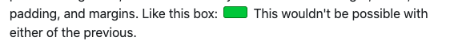

- [Css Box Model](#css-box-model)
  - [Display](#display)
# Css Box Model

## Display

Every tag in CSS has a `display` property associated with it by default. 
In fact, CSS has a lot of hidden defaults, just like by-default all text's color is black. With `display`, it varies by what type of tag we're talking about. 

`div`s are `display: block;` by default while `span`s are `display: inline;` and this makes sense given their functions. However, being that we have access to CSS, we can manipulate a `span` to act like a `div`and vice-versa (though usually you'd just use the appropriate tag.) We'll list out a few of the options here of what display can be:

1. `inline` - Like it sounds, it makes whatever `tag` is, behave like text. 
   1. 💡 Here, the browser determines all the height, width, padding, margins etc. for you and **will *NOT* let you change it**.
   2. So, if you're trying to set the width or height and it's not respecting it, it's probably the wrong `display` type.
2. `block` - `div`s and `p`s are by default `display:block;`
   1. This gives you control over the height, width, padding, margins etc. of something.
   2. By default, anything that is a `block` takes the *whole line* to itself.
3. `inline-block` - A hybrid of the previous 2.
   1. This will make the browser try to place the tag inline, but still allow you to control the height, width, padding and margins.
   2. 